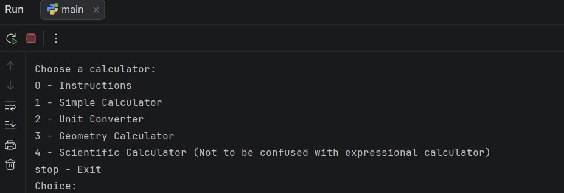

# Python Calculator Suite

A multi-purpose calculator written in Python.

## Features

- Basic Calculator
- Scientific Calculator
- Unit Converter
- 2D Geometry Calculator
- 3D Geometry Calculator

## Technologies Used

- Python 3
- Built-in `math` module

## How to Run

1. Make sure Python 3 is installed.
2. Download or clone this repository.
3. Run:

```bash
python main.py
```

## About

This project was created as a personal programming project to practice Python programming, mathematical calculations, functions, loops, and input validation.
